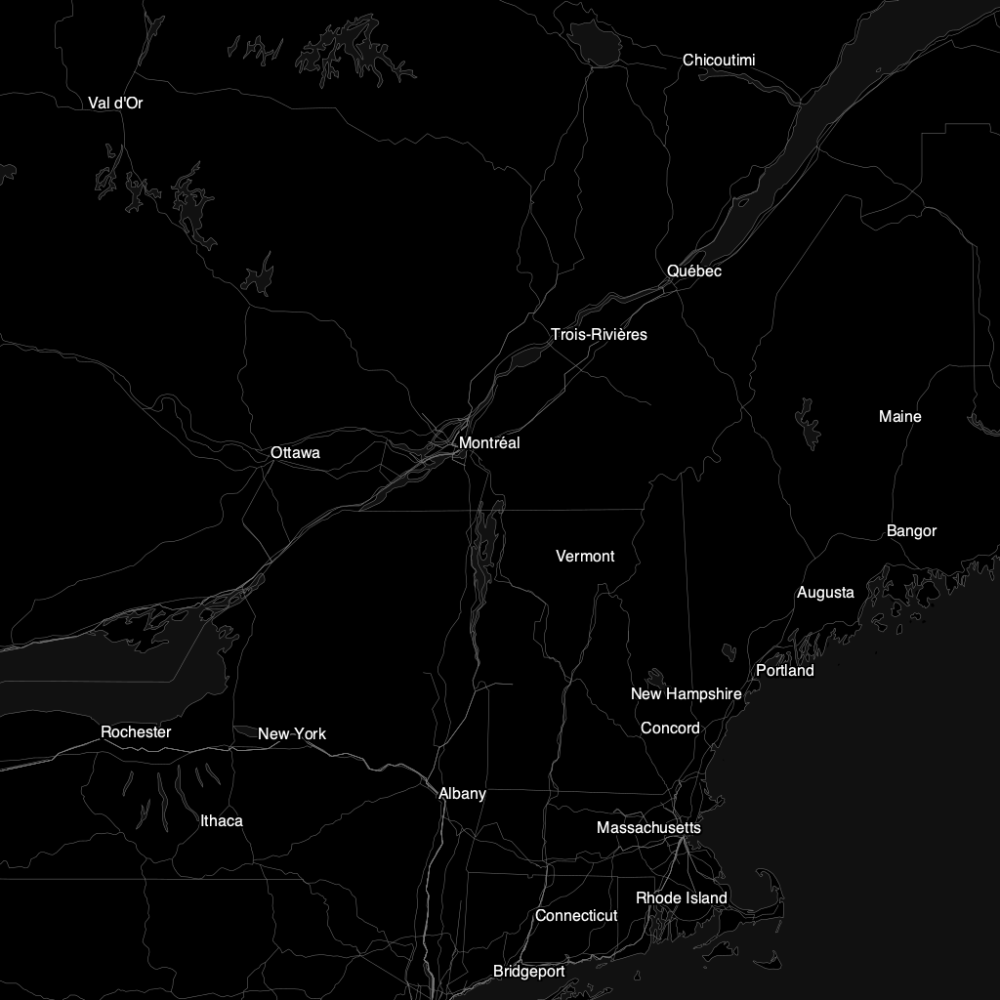

# α

A map renderer for the server and WebAssembly.

 

Map data © OpenStreetMap

## How to use
This is an experiment. You almost certainly don't want to use it right now.

Cairo backend:
`cargo run INPUT.mvt OUTPUT.png`

WebAssembly:
`cd alpha-web && wasm-pack build --no-typescript --target web`
